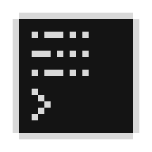

# Line by Line



A minimal, local-first desktop journaling app for fast private writing.

Write one entry at a time. Press `Enter` and it disappears — encrypted, sealed, unreadable until its unlock date. Come back later and read what you wrote when you were ready to say it, not to read it.

> Write it. Seal it. Meet it later.

---

## What it is

Line by Line is a **delayed-reflection journal**. It is not a note-taking app, a task manager, or a diary with search. It is specifically designed to make the act of writing feel low-stakes and immediate, while preserving those thoughts for a future you to read.

Entries are encrypted locally the moment you submit them. A scrambled preview (same shape, different letters) is all you see until the unlock date passes.

---

## Features

- **Local encryption** — AES-256-GCM. No cloud, no accounts, no server.
- **Passphrase vault** — PBKDF2-SHA256 key derivation. Your passphrase never leaves your machine.
- **Delayed unlock** — each entry has a configurable unlock delay (default: 1 day). Entries are readable only after that time.
- **Sealed preview** — scrambled text preserving the shape of your writing (word lengths, punctuation, capitalisation) without revealing content.
- **Notebooks and pages** — organise entries into notebooks and pages, or write everything into the default `Journal` stream.
- **Terminal-style UI** — keyboard-first, no mouse required. Black background, monospace font.
- **Configurable** — font size, accent colour, unlock delay, and entry limit are all adjustable from `/settings`.
- **Export** — write unlocked entries to a plain `.txt` file via `/export`.

---

## Tech stack

| Layer | Choice |
|---|---|
| Language | C# / .NET 7 |
| UI | Avalonia 11 (MVVM) |
| Database | SQLite via Microsoft.Data.Sqlite |
| Encryption | AES-256-GCM (`System.Security.Cryptography`) |
| Key derivation | PBKDF2-SHA256, 300,000 iterations |
| MVVM toolkit | CommunityToolkit.Mvvm |

---

## Getting started

### Requirements

- Windows 10/11
- [.NET 7 SDK](https://dotnet.microsoft.com/download/dotnet/7.0)

### Run

```bash
cd LineByLine.App
dotnet run
```

### Build release

```bash
dotnet publish LineByLine.App -c Release -r win-x64 --self-contained
```

---

## Usage

On first launch the app asks you to create a passphrase. This derives the vault encryption key — **there is no recovery if you forget it.**

After unlocking, write freely. Press `Enter` to seal an entry. Use `Shift+Enter` for multi-line entries.

### Keyboard shortcuts

| Key | Action |
|---|---|
| `Enter` | Seal and submit entry |
| `Shift+Enter` | New line within entry |
| `Esc` | Clear current draft |
| `Ctrl+L` | Lock vault immediately |
| `Ctrl+W` | Emergency close (saves draft as `[interrupted]`) |
| `Tab` | Autocomplete commands |
| `Page Up / Down` | Scroll entry list |

### Commands

Type any command at the `>` prompt and press `Enter`.

| Command | Description |
|---|---|
| `/help` | Show all commands |
| `/unlocked` | Read entries whose unlock date has passed |
| `/notebooks` | List notebooks |
| `/use <notebook>` | Switch to a notebook |
| `/new notebook <name>` | Create a new notebook |
| `/pages` | List pages in current notebook |
| `/page <title>` | Switch to a page |
| `/new page <title>` | Create a new page |
| `/trash` | List soft-deleted entries |
| `/restore last` | Restore the last deleted entry |
| `/delete last` | Delete the most recent entry |
| `/export` | Export unlocked entries to a `.txt` file |
| `/settings` | Open settings |
| `/lock` | Lock the vault |

### Settings

Open `/settings` and type a command at the prompt:

| Setting | Options |
|---|---|
| `delay <value>` | `15s` `1h` `1d` `1w` `1mo` `3mo` `1y` |
| `limit <n>` | Any positive number |
| `size <value>` | `small` `medium` `large` |
| `color <value>` | `blue` `green` `amber` `red` `mono` |

---

## Data

The vault is stored at:

```
%APPDATA%\LineByLine\linebyline.vault.db
```

This is a standard SQLite database. The entry text is encrypted; timestamps, notebook names, page titles, and sealed previews are stored in plaintext.

**Losing your passphrase means losing your entries.** There is no server-side recovery.

---

## Project structure

```
LineByLine.App/
  Crypto/          AES-GCM encryption, PBKDF2 key derivation, sealed preview generation
  Data/            SQLite repositories (entries, notebooks, pages, settings)
  Models/          Domain models (Entry, Notebook, Page, VaultMetadata)
  Services/        VaultService, SettingsService
  ViewModels/      MVVM view models for each screen
  Views/           Avalonia AXAML views
docs/
  DATA_MODEL.md
  DESIGN.md
  IMPORTANT_APP_FEATURES.md
  TECH_STACK.md
  FUTURE_FEATURES.md
  TIMELINE.md
```

---

## Limitations

- Unlock timing is **app-enforced**, not cryptographically guaranteed. A technical user with direct SQLite access could read entries before their unlock date.
- No cloud sync, multi-device support, or backup mechanism (other than copying the `.vault.db` file).
- The app is Windows-first. Avalonia supports other platforms, but packaging and testing has only been done on Windows.

---

## Licence

Personal / private use. No licence assigned yet.
